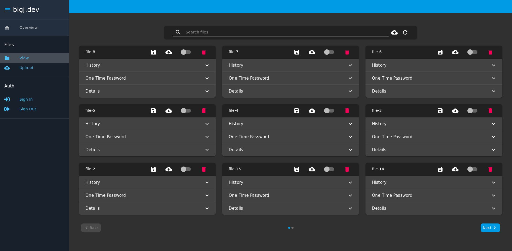

# bigj.dev
[](https://gitlab.com/b1g_J/bigj.dev/commits/master)

This is my personal file website. With this site, you can self host all your own files instead of using services like drive or dropbox. 
The main idea here is that every file has a short, human memorable link (no hashes forced apon you). 
Using the webui, you can set public/private permissions for files, along with generate one time links.
Every download attempt (allowed, or blocked) is recorded in the database, and is easily accesable in the ui.
I use this to generate links for resources that I want to share with friends.
By self hosting these files, I have full control over access of my files, along with logs for downloads.
Please use this as a tool to take back control of your data.



## Features
- Short memorable shareable links
- Public / Private permissions
- One time use links for private resources
- Downloads (ip address and timestamp) are tracked in database
- Material-ui web interface for easily managing resources and permissions
- SSL certs handled by traefik (not by you)
- Fully containerized
- Moble UI support

## Deployment
This project consists of a [traefik](https://traefik.io/) edge router, a [koajs](https://koajs.com/) api, and a frontend for serving html and bundled [reactjs](https://reactjs.org/). All config for this deployment is done through environment variables.

### Required environment config
Each of these variables are required for deployment. The deploy.sh script will block you from starting the services if these variables are not set. 
```
ACME_EMAIL=john.doe@email.com   # email for lets encrypt cert (any valid email will work)

MYSQL_ROOT_PASSWORD=password    # password for mysql database
API_DOMAIN=f.bigj.dev           # domain that app will be deployed on

UPLOAD_PATH=~/uploads           # place where files will be hosted
CONFIG_PATH=/var/lib/f.bigj.dev # a place to put the persistent data for traefik and mysql
```

### Optional environment config
These variables are not required. You will get a warning if you deploy without these, you will get a warning.
```
API_ROOT_PASSWORD=password      # default root password for api (set at api startup)
```

#### CD/CI
Set your environment config in as your runner environment variables.

#### Manual Deploy
The cleanest way to handle a manual deploy would be a `.env` file.


### deploy
Once you have all your config set up, you can just run the `./deploy.sh` to start all the services. 
Before starting the services, it does checks for things

# Contribution
Please contribute! If you want to use this app, and make it better pr this repo!

# Maintainer
- big_J
